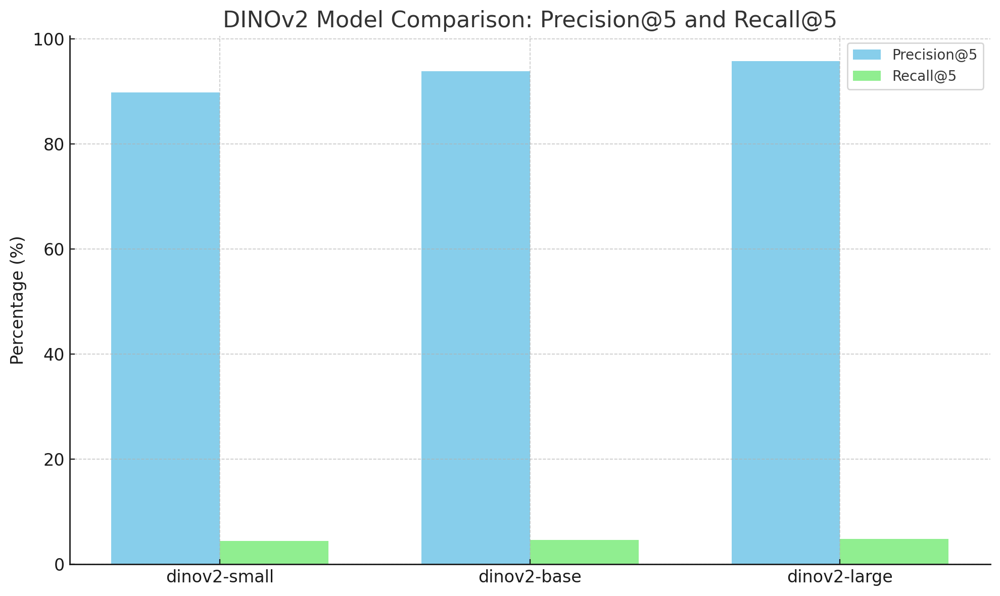
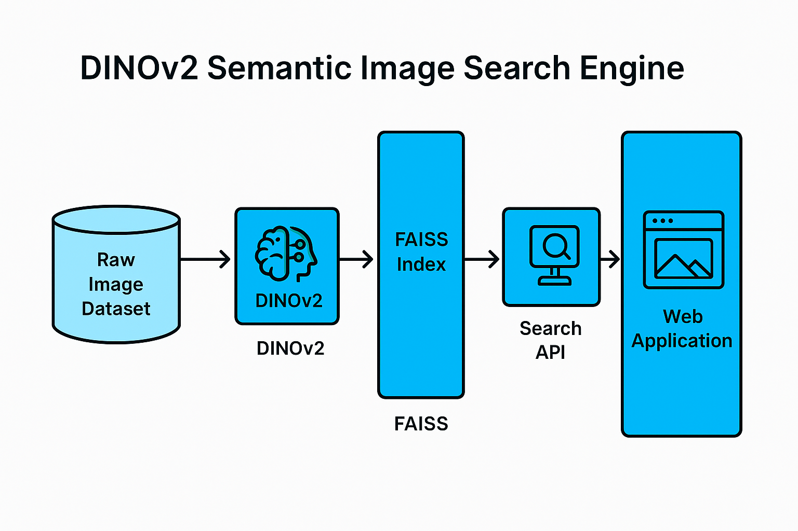

# 🧠 DINOv2 Semantic Image Search Engine

A modular, vision-only semantic image search engine powered by **DINOv2** vision transformers and **FAISS** for efficient, semantic nearest-neighbor search.

## 🚀 Project Features

- Batch embedding extraction using DINOv2 (small, base, large models)
- FAISS index building for efficient semantic search
- Model comparison based on Precision@5 and Recall@5
- Interactive Streamlit-based frontend for uploading images and retrieving similar matches
- FastAPI backend for scalable, modular API architecture
- Automatic model selection, dynamic indexing
- Full evaluation pipeline with pseudo-labeling and t-SNE visualization

## 🗂 Dataset

This project uses a subset of the CIFAR-10 dataset for evaluation and demonstration purposes. CIFAR-10 contains 60,000 32x32 color images in 10 different classes. The dataset was used to:
- Extract semantic features using DINOv2 models.
- Perform pseudo-label clustering via KMeans (unsupervised) to simulate semantic groupings.
- Evaluate the retrieval quality by checking cluster consistency in search results.

## 📊 DINOv2 Model Comparison (Evaluation Report)

| Model         | Precision@5 (%) | Recall@5 (%) |
|---------------|-----------------|--------------|
| dinov2-small  | 89.8             | 4.4          |
| dinov2-base   | 93.8             | 4.6          |
| dinov2-large  | 95.8             | 4.8          |

### 🔍 Observations
- **Precision** improves consistently as model size increases.
- **Recall** remains stable due to clustering approximation.
- **Tradeoff**: `dinov2-large` provides best semantic retrieval at the cost of inference speed.




## 🔧 Installation

```bash
# Clone the repository
git clone https://github.com/nelson960/Semantic_Image_Search_Engine.git
cd Semantic_Image_Search_Engine

# Create virtual environment
python -m venv .venv
source .venv/bin/activate  # Linux/macOS
.venv\Scripts\activate    # Windows

# Install dependencies
pip install -r requirements.txt
```

---


## 🛠️ How It Works

1. Upload images (ZIP) via the Streamlit UI.
2. Extract embeddings using the selected DINOv2 model.
3. Build a FAISS index from the extracted embeddings.
4. Upload a query image.
5. The system searches the FAISS index and retrieves top-K semantically similar images.


---

## 🔥 API Usage (FastAPI)

```bash
uvicorn api.server:app --reload
```

**Example cURL Command:**

```bash
curl -X POST "http://localhost:8000/search/?top_k=5" \
  -F "file=@/path/to/query_image.jpg"
```

---

## 💻 Frontend (Streamlit)

```bash
streamlit run ui/app.py
```

- Upload ZIP images
- Select DINOv2 model for embedding
- Extract and index in one click
- Upload and search images
- Visualize results in the UI

---

## 🔍 Use Cases

- **Reverse Image Search**
- **Product Recommendation Systems**
- **Content-Based Image Retrieval**
- **Semantic Clustering and Tagging**

---

## 📄 License

MIT License © 2025 Nelson960

---

## 🙏 Acknowledgments

- [Meta AI - DINOv2](https://github.com/facebookresearch/dinov2)
- [FAISS by Facebook AI](https://github.com/facebookresearch/faiss)
- [FastAPI](https://fastapi.tiangolo.com)
- [Streamlit](https://streamlit.io)

